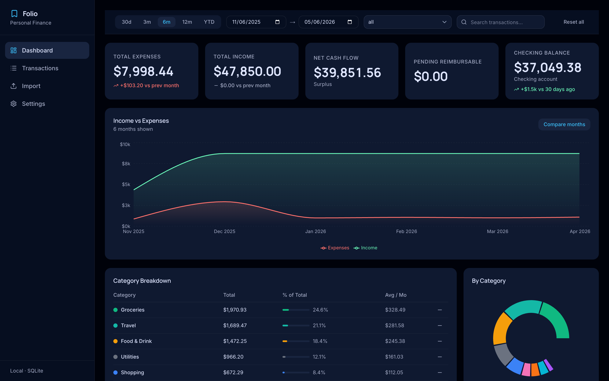
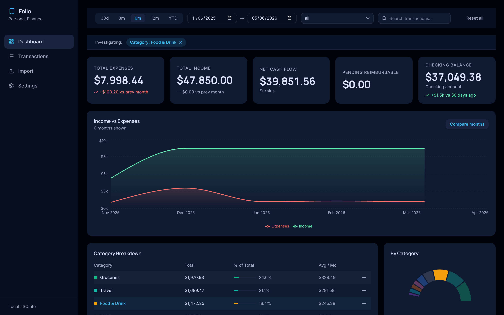
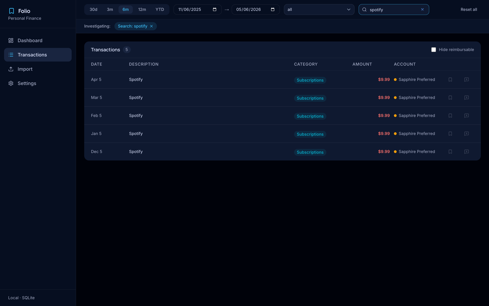
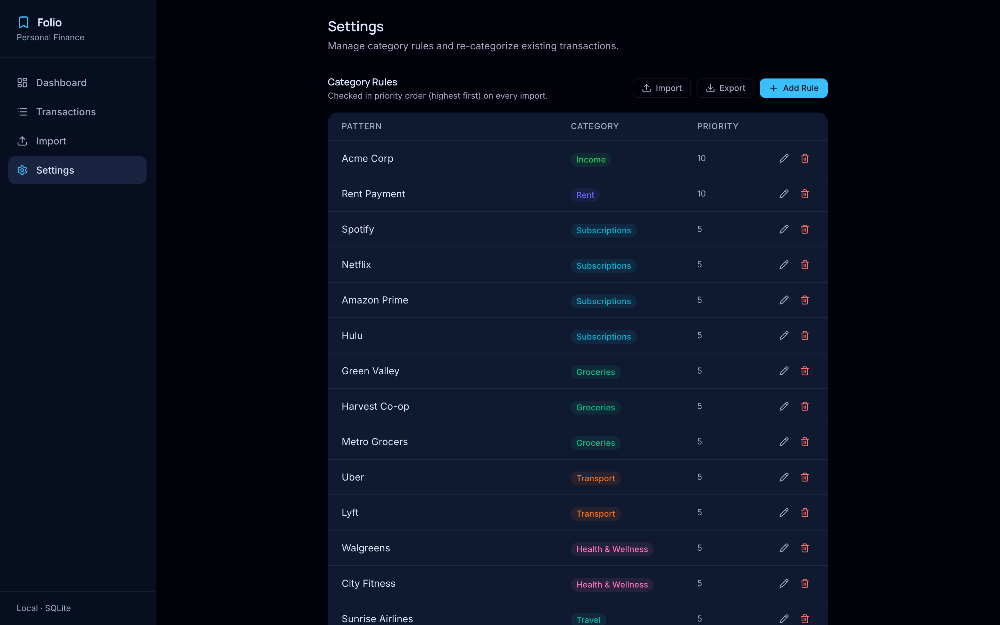

<div align="center">

# Folio

**A local-first personal finance dashboard built with Next.js, TypeScript, and SQLite.**

Import your Chase CSV exports, track spending by category and merchant, and keep everything on your machine — no accounts, no cloud sync, no subscriptions.


</div>

---



---

## Why I built this

Most personal finance apps require you to hand over bank credentials or pay a monthly fee. I wanted something that works entirely offline: drag in a CSV export from Chase, get a clear picture of where money went, and never touch a third-party server. The secondary goal was to build a full-stack portfolio piece that touches every layer — database design, CSV normalization, REST API, interactive charting, and client state management.

---

## Features

**Spending analysis**
- Monthly income vs. expenses area chart (6-month trend or two-month comparison)
- Category breakdown with donut chart and sortable table
- Top-merchants bar chart — click any merchant to drill into their transactions
- Running checking-account balance chart over time

**Cross-filtering**
- Click any category, month, or merchant to instantly filter every chart and the transaction table simultaneously
- Active filters shown as dismissible chips; one click to clear

**Transactions**
- Paginated table with full-text search across all descriptions
- Per-transaction category editing, notes, and reimbursable flag
- Date range, account, and category filters

**Data management**
- Chase CSV import for both checking and credit card formats
- Content-hash deduplication — re-importing the same file is always safe
- Category rules engine: define keyword patterns, set priority, export/import as JSON
- One-command database reset with 12 months of realistic demo data

---

## Screenshots

<table>
  <tr>
    <td width="50%">
      
      <p align="center"><em>Cross-filter: clicking a category updates every chart in real time</em></p>
    </td>
    <td width="50%">
      
      <p align="center"><em>Full-text search across 12 months of transactions</em></p>
    </td>
  </tr>
  <tr>
    <td width="50%" colspan="2">
      
      <p align="center"><em>Category rules engine — keyword patterns, priority ordering, JSON import/export</em></p>
    </td>
  </tr>
</table>

---

## Engineering highlights

**Content-hash deduplication** — Transaction IDs are `SHA-256(date|description|amount)` truncated to 16 chars. The upload API uses `INSERT OR IGNORE`, so importing the same CSV twice is a guaranteed no-op with no extra query needed.

**Synchronous SQLite** — `better-sqlite3` is synchronous. No `await` on queries, no connection pool, no race conditions. For a single-user local app this simplifies every API route to a straight function call.

**Chase CSV normalization** — Two Chase formats (checking and credit card) have different column layouts, sign conventions, and description noise. The parser detects the format from headers, then strips ACH identifiers, exchange-rate suffixes, reference numbers, and date stamps before title-casing the result.

**Zustand cross-filter store** — A single `useFilterStore` slice holds all active filters. SWR hooks derive their query strings from the store via `buildParams()`, so every chart and table automatically refetches with consistent params whenever any filter changes.

**Type-safe throughout** — No `any` types in the codebase. All shared shapes live in `lib/types.ts`. Zero TypeScript errors, zero build errors.

---

## Stack

| Layer | Technology |
|---|---|
| Framework | Next.js 16 (App Router) |
| Language | TypeScript 5 |
| Database | SQLite via better-sqlite3 + Drizzle ORM |
| CSV parsing | papaparse |
| Charts | Recharts |
| Styling | Tailwind CSS v4 + shadcn/ui |
| State | Zustand |
| Data fetching | SWR |

---

## Quick start

```bash
# Clone and install
git clone <repo-url> && cd folio
npm install

# Seed 12 months of demo data and start
npm run db:reset-demo
npm run dev
# Open http://localhost:3000
```

Or import your own data:

```bash
npm install
mkdir -p data
npx drizzle-kit push   # create the schema
npm run dev
# Go to /upload and drag in your Chase CSV exports
```

### All scripts

| Command | Description |
|---|---|
| `npm run dev` | Start dev server at http://localhost:3000 |
| `npm run build` | Production build |
| `npm run db:seed` | Seed demo data into an existing database |
| `npm run db:reset-demo` | Wipe, recreate schema, seed demo data |
| `npm run db:reset` | Wipe and recreate schema only |
| `npm run type-check` | TypeScript type check with no emit |
| `npm run screenshots` | Capture app screenshots with Playwright |

---

## Architecture

See [ARCHITECTURE.md](ARCHITECTURE.md) for a full walkthrough: CSV → parser → normalization → SQLite storage, the Zustand store structure, API route patterns, and database design decisions.

Planned features (budgets, recurring detection, multi-bank support, Electron wrapper): [ROADMAP.md](ROADMAP.md).

---

## License

MIT — see [LICENSE](LICENSE).
